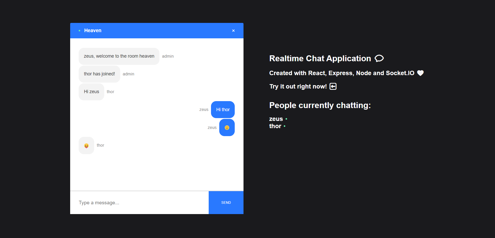
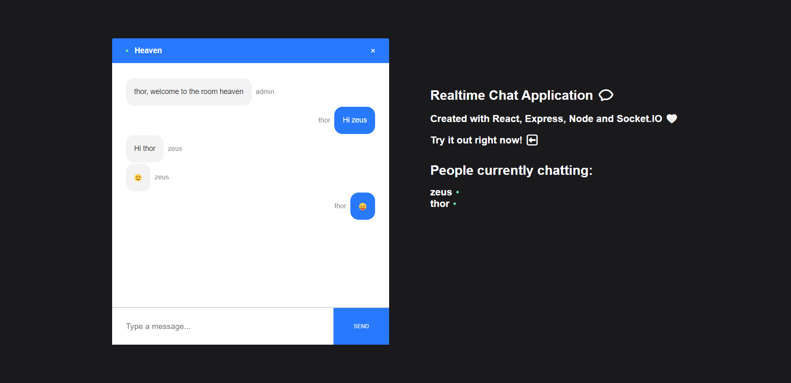

Realtime Chat Application: Seamless Communication with ReactJS and NodeJS
=========================================================================  

[Live Website](https://utkarsh-react-chat-app.netlify.app/)  

The Realtime Chat Application is a cutting-edge platform that leverages ReactJS on the front end and NodeJS, along with the Socket.io library, on the backend, to enable instantaneous, real-time messaging. This application revolutionizes the way people connect and communicate online, offering a responsive and dynamic environment for users to send and receive messages without any delay.  

## Key Features:  

* *ReactJS Front End*: The use of ReactJS ensures a sleek, user-friendly interface that adapts seamlessly to different devices, providing a consistent and enjoyable messaging experience.  

* *NodeJS + Socket.io Backend*: The NodeJS backend, coupled with the Socket.io library, empowers the application to send and receive messages in real-time, creating a truly dynamic and interactive chat environment.  

* *Instantaneous Communication*: Users can exchange messages instantly, making it ideal for both personal and professional communication needs.  

* *Responsive Design*: The application's design is responsive, catering to various screen sizes and ensuring that users can chat on the go.  

* *Scalability*: The architecture is built to scale, accommodating a growing user base and ensuring that the chat experience remains smooth and uninterrupted.  

The Realtime Chat Application redefines online communication, providing a platform where conversations happen as naturally as in person. Whether it's for team collaboration, staying connected with friends and family, or simply having fun conversations, this application brings the immediacy and vibrancy of real-time chat to your fingertips. It's the future of online communication, and it's here to enhance your digital interactions.  

  

  

  
